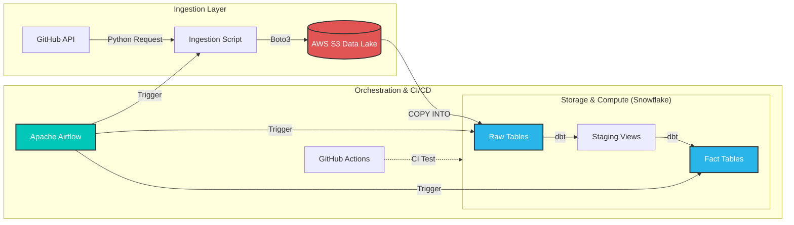

# 🚀 End-to-End ELT Data Pipeline (GitHub to Snowflake)

[](https://github.com/Suhasrv2403/Github_commits_pipeline/actions)
[](https://www.getdbt.com/)
[](https://airflow.apache.org/)
[](https://www.snowflake.com/)
[](https://aws.amazon.com/)
[](https://www.python.org/)

## 📖 Project Overview
This project is a production-grade **ELT (Extract, Load, Transform)** pipeline designed to analyze development velocity. It ingests raw data from the GitHub API, moves it through a cloud-native architecture, and models it for analytics.

The goal was to build a system that mimics a real-world enterprise data platform, focusing on **automation, security (key rotation/secrets management), and CI/CD**.

## 🏗️ System Architecture

This pipeline follows a modular architecture ensuring separation of concerns between ingestion, storage, and transformation.


* **Automated Quality Checks:** GitHub Actions pipeline runs `dbt run` and `dbt test` against a clean Snowflake schema on every push to ensure code stability.
* **Infrastructure as Code:** Snowflake Stages and File Formats are managed via SQL scripts.
* **Idempotency:** The pipeline is designed to be re-runnable; duplicate data ingestion is handled during the transformation layer.

## 📂 Project Structure
```bash
├── airflow/
│   ├── dags/                  # Airflow DAGs (Pipeline logic)
│   └── scripts/               # Python scripts for AWS/GitHub logic
├── dbt_project/
│   ├── models/                # SQL transformation logic (Staging & Marts)
│   ├── tests/                 # Custom data quality tests
│   └── dbt_project.yml        # dbt configuration
├── .github/workflows/         # CI/CD YAML configurations
├── requirements.txt           # Python dependencies
└── README.md                  # System Documentation
```
## 📊 Data Modeling (dbt)
* The transformation layer follows Dimensional Modeling principles:

* stg_commits: cleans raw JSON data, casts timestamps, and standardizes author names.

* fct_daily_metrics: aggregates commit volume by day and author to track velocity trends.

## 🚀 How to Run Locally

### 1. Clone the Repository
```bash
git clone [https://github.com/YOUR_GITHUB_USERNAME/YOUR_REPO_NAME.git](https://github.com/YOUR_GITHUB_USERNAME/YOUR_REPO_NAME.git)
cd YOUR_REPO_NAME
```

### 2. Configure Secrets
Create a .env file in the root directory:
```bash
SNOWFLAKE_ACCOUNT=your_account
SNOWFLAKE_USER=your_user
SNOWFLAKE_PASSWORD=your_password
SNOWFLAKE_ROLE=accountadmin
AWS_ACCESS_KEY_ID=your_aws_key
AWS_SECRET_ACCESS_KEY=your_aws_secret
GITHUB_TOKEN=your_github_token
```
### 3. Initialize Airflow
```bash
export AIRFLOW_HOME=$(pwd)/airflow
airflow scheduler & airflow webserver
```

### 4. Trigger the Pipeline
* Access the UI at http://localhost:8080 and toggle the github_elt_pipeline DAG to ON.

Built by Suhas Ramesh Vittal


