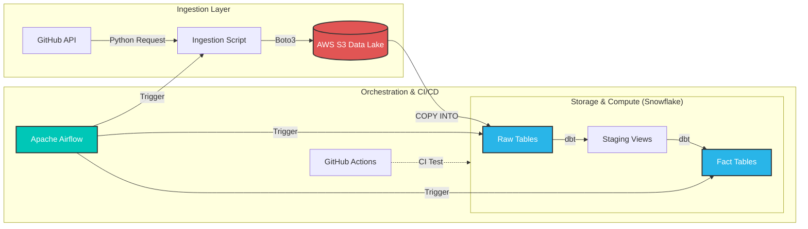

# 🚀 End-to-End ELT Data Pipeline (GitHub to Snowflake)

[](https://github.com/Suhasrv2403/Github_commits_pipeline/actions)
[](https://www.getdbt.com/)
[](https://airflow.apache.org/)
[](https://www.snowflake.com/)
[](https://aws.amazon.com/)
[](https://www.python.org/)

## 📖 Project Overview
This project is a production-grade **ELT (Extract, Load, Transform)** pipeline designed to analyze development velocity. It ingests raw data from the GitHub API, moves it through a cloud-native architecture, and models it for analytics.

The goal was to build a system that mimics a real-world enterprise data platform, focusing on **automation, security (key rotation/secrets management), and CI/CD**.

## 🏗️ System Architecture

This pipeline follows a modular architecture ensuring separation of concerns between ingestion, storage, and transformation.


```mermaid
graph LR
    subgraph Ingestion ["Ingestion Layer"]
        API[GitHub API] -->|Python Request| Local[Ingestion Script]
        Local -->|Boto3| S3[(AWS S3 Data Lake)]
    end

    subgraph Warehouse ["Storage & Compute (Snowflake)"]
        S3 -->|COPY INTO| Raw[Raw Tables]
        Raw -->|dbt| Stg[Staging Views]
        Stg -->|dbt| Fact[Fact Tables]
    end

    subgraph Orchestration ["Orchestration & CI/CD"]
        Airflow[Apache Airflow] -->|Trigger| Local
        Airflow -->|Trigger| Raw
        Airflow -->|Trigger| Fact
        GitHub[GitHub Actions] -.->|CI Test| Warehouse
    end

    style S3 fill:#E15554,stroke:#333,stroke-width:2px,color:white
    style Raw fill:#29b5e8,stroke:#333,stroke-width:2px,color:white
    style Fact fill:#29b5e8,stroke:#333,stroke-width:2px,color:white
    style Airflow fill:#00C7B7,stroke:#333,stroke-width:2px,color:white

```
* **Automated Quality Checks:** GitHub Actions pipeline runs `dbt run` and `dbt test` against a clean Snowflake schema on every push to ensure code stability.
* **Infrastructure as Code:** Snowflake Stages and File Formats are managed via SQL scripts.
* **Idempotency:** The pipeline is designed to be re-runnable; duplicate data ingestion is handled during the transformation layer.

## 📂 Project Structure
```bash
├── orchestration/
│   ├── dags/                  # Airflow DAGs (Pipeline logic)
│   ├── Dockerfile             # Airflow image (adds dbt/boto3/etc.)
│   └── docker-compose.yaml    # Local Airflow + Postgres stack
├── src/
│   └── extract.py             # GitHub -> S3 extraction script
├── transform/my_pipeline/     # dbt project
│   ├── models/                # SQL transformation logic (Staging & Fact)
│   ├── tests/                 # Custom data quality tests
│   └── dbt_project.yml        # dbt configuration
├── config/
│   └── ci_profiles.yml        # dbt connection profile used only in CI
├── tests/                     # Python unit tests (pytest)
├── .github/workflows/         # CI/CD YAML configurations
├── requirements.txt           # Python dependencies
├── LICENSE
└── README.md                  # System Documentation
```
## 📊 Data Modeling (dbt)
* The transformation layer follows Dimensional Modeling principles:

* stg_commits: cleans raw JSON data and casts timestamps/author names into typed columns.

* fact_commits: materializes one row per commit (with a derived `commit_date`) for daily reporting.

## 🚀 How to Run Locally

### 1. Clone the Repository
```bash
git clone https://github.com/Suhasrv2403/Github_commits_pipeline.git
cd Github_commits_pipeline
```

### 2. Configure Secrets
Copy [.env.example](.env.example) to `.env` in the root directory and fill in real values
(GitHub token, AWS keys, Snowflake credentials, and an Airflow Fernet key —
the file has a one-liner for generating the latter). Never commit `.env`.

### 3. Start Airflow (Docker Compose)
```bash
docker compose --env-file .env -f orchestration/docker-compose.yaml up
```

### 4. Trigger the Pipeline
* Access the UI at http://localhost:8080 and toggle the `elt_pipeline` DAG to ON.

Built by Suhas Ramesh Vittal


