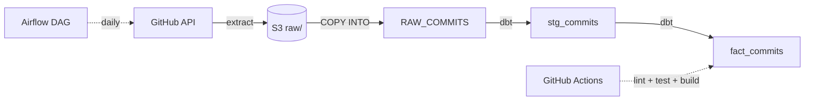

# GitHub Commit Analytics Pipeline

[](https://github.com/Suhasrv2403/Github_commits_pipeline/actions)
[](https://www.getdbt.com/)
[](https://airflow.apache.org/)
[](https://www.snowflake.com/)
[](https://aws.amazon.com/)
[](https://www.python.org/)

An automated ELT pipeline that pulls commit activity from the GitHub API,
lands it in S3, loads it into Snowflake, and transforms it into
analytics-ready tables with dbt — orchestrated daily by Airflow and
gated by CI (lint + unit tests + `dbt build`) on every push. It's built
the way a real data platform team ships a pipeline: config-driven, no
hardcoded secrets, reproducible from a clean checkout, and tested at the
extraction layer where the actual logic (pagination, retries, error
handling) lives.

**Stack:** Python · Apache Airflow · dbt · Snowflake · AWS S3 · Docker · GitHub Actions · pytest · ruff

## Why this matters

Engineering teams generate a constant stream of commit activity, but
that signal is locked inside GitHub's own UI and invisible to anyone
who isn't a developer. This pipeline turns raw commit history into a
queryable warehouse table — who committed what, and when — so an
engineering manager, a data team, or an internal dashboard can build
velocity tracking, contributor reporting, or release-readiness checks
on top of it, without anyone manually exporting CSVs from GitHub.

## Architecture


```mermaid
graph LR
    API[GitHub API] -->|extract| S3[(S3 raw/)]
    S3 -->|COPY INTO| Raw[RAW_COMMITS]
    Raw -->|dbt| Stg[stg_commits]
    Stg -->|dbt| Fact[fact_commits]
    Airflow[Airflow DAG] -.daily.-> API
    CI[GitHub Actions] -.lint + test + build.-> Fact
```

Four Airflow tasks run in sequence: `extract_github_data -> load_to_snowflake
-> dbt_transform -> dbt_test`. Full task-by-task breakdown, the dbt
lineage, and the reasoning behind each design decision are in
[docs/DESIGN.md](docs/DESIGN.md).

## How to run

```bash
git clone https://github.com/Suhasrv2403/Github_commits_pipeline.git
cd Github_commits_pipeline
cp .env.example .env   # fill in GitHub/AWS/Snowflake creds + a generated Fernet key
docker compose --env-file .env -f orchestration/docker-compose.yaml up
```

Then open http://localhost:8080 and toggle the `elt_pipeline` DAG on.
Non-secret, tunable settings — which repo to pull, page counts, retry
policy, schedule — live in [configs/config.yml](configs/config.yml), not
in code.

Run the checks CI runs, locally:
```bash
pip install -r requirements-dev.txt
ruff check src/ scripts/ tests/ orchestration/dags/ conftest.py
pytest tests/ -v
```

## At scale

This pipeline is sized to demonstrate the pattern on one repo, not to
run against every repo in a large org. Getting there would mean
replacing the fixed 5-page GitHub fetch with cursor-based pagination
(the `Link` header, or the GraphQL API) so history stops being silently
truncated; moving Airflow from `LocalExecutor` to `CeleryExecutor` or
`KubernetesExecutor` so many repos can extract and transform in
parallel; and adding a dead-letter path for records that fail to load
instead of today's `ON_ERROR = 'continue'`. It would also need real
monitoring — Airflow SLAs/alerts and dbt source-freshness checks —
rather than relying on someone noticing a red DAG in the UI.

## Repo structure

```bash
├── src/                     # Core library: GitHub API + S3 upload functions
├── scripts/                 # CLI entry point (calls into src/)
├── orchestration/           # Airflow DAG, Dockerfile, docker-compose
├── transform/my_pipeline/   # dbt project: models, macros, one-time setup SQL
├── configs/                 # config.yml (tunable settings), ci_profiles.yml
├── tests/                   # pytest unit tests
├── docs/                    # Design notes, limitations, references
└── .github/workflows/       # CI: lint + pytest + dbt build/test
```

Deep technical detail — the full dbt lineage, security/reproducibility
decisions, known limitations, and references — lives in
[docs/DESIGN.md](docs/DESIGN.md) rather than here.

---
Built by Suhas Ramesh Vittal
